## Dual-interface control routing

Ultimate hardware tested with both Ethernet and Wi-Fi enabled delays responses
from the wired REST endpoint by approximately 2.5 seconds. The same behaviour
was reproduced on an Ultimate 64 running firmware 3.15 and an older C64
Ultimate running different firmware. It occurs immediately after boot and does
not require a u64deck discovery scan.

When Finder has verified and grouped both interfaces and Ethernet is selected,
u64deck keeps the command socket, FTP and streaming path on Ethernet while
routing ordinary REST control through the verified Wi-Fi address. The connected
header shows **Ethernet · REST via Wi-Fi**; the split-routing screenshot below
shows this state in context. If Wi-Fi is disabled or not verified, the selected
address is used for all transports as before. Historical Wi-Fi addresses are
never selected automatically.

This is an application-side routing workaround, not a firmware fix. Disable
Ultimate Wi-Fi and power-cycle the device to restore normal wired REST latency
when testing the Ethernet REST endpoint itself.

> **⚠️ Recommendation: run your Ultimate with a single active interface.**
> With both Ethernet and Wi-Fi enabled, the firmware behaviour above makes
> control intermittently unreliable in practice — the same operation can
> succeed one minute and time out the next, even with u64deck's split
> routing working around the worst of it. **Ethernet-only** (disable Wi-Fi
> in the Ultimate's network settings, then power-cycle) is the
> configuration everything is happiest in. Dual-interface operation works,
> but treat it as best-effort until the firmware behaviour changes.

# u64deck

**v1.9.0 — Release Candidate 44 · build fc1e0fb**


A lightweight, self-hosted control deck for the **Ultimate 64** (and, minus the
screen mirror, the 1541 Ultimate-II+). One small Python server, a plain HTML/CSS/JavaScript interface,
no frontend build step, no Electron.

Built as a leaner alternative to Ultimate64 Manager / Assembly64 with a focus on:

- **Full settings access** — every configuration category the firmware exposes,
  editable in place (enums become dropdowns, ranges become number fields),
  with apply / save-to-flash / load-from-flash / factory-reset.
- **Connection-ready Settings startup** — on first load or Ctrl+F5, firmware
  settings wait for the normal Ultimate information check, show a neutral
  waiting/retrying state and load automatically. Transient refused connections
  are retried silently; only a bounded persistent failure is surfaced, and
  Diagnostics names the exact Settings operation that failed. Search Index &
  Cache remains visible near the top of Settings, while the occasional-use
  Ultimate firmware configuration lives in a collapsed section below it.
- **Disk images as first-class objects** — browse *inside* a D64/D71/D81
  (from Ultimate storage or a local file) and act on individual files:
  - **Run** — extracts just that PRG and DMA-runs it. No mounting, no
    `LOAD"$",8`, no waiting for a 1541.
  - **Load** — same, but without RUN (handy for ML monitors / dev work).
  - **Mount & Load** — for multi-load software: mounts the image, resets, and
    types `LOAD"name",8,1` + `RUN` through the supported input path for you.
  - **Create blank images** — create formatted D64/D71/D81/DNP files in an
    Ultimate storage folder. Enter USB0, SD, Flash, Temp or another mounted
    folder first; the top-level `/` is only a virtual device list.
- **Screen mirror with a keyboard that works** — VIC stream rendered at 50 fps
  on a canvas; click it and type. On supported Ultimate 64 firmware, interactive
  keys use CIA1 matrix-level press/release events, including held keys, chords,
  cracktros, games and the Ultimate menu. Older firmware and unsupported
  hardware fall back automatically to the established KERNAL keyboard buffer.
- **Stale manual-operation protection** — Legacy screen-mirror keys and manual
  Reset/Reboot requests are no longer allowed to sit behind a long Mount & Run
  and execute against a later cartridge state. Legacy keys are rejected while
  Mount & Run owns the device and expire after two seconds if still waiting;
  Reset/Reboot are rejected or coalesced instead of being delivered late.
  CIA1 matrix input, `release_all`, Jukebox Stop and Mount & Run's own inline
  reset retain their established paths.
- **System Health dashboard** — view cached Ultimate REST latency and
  reliability, stream throughput and gap history, browser render/audio health,
  device-queue contention, active-task phases, index throughput, cache hit rates,
  process/host resources and persistence/lifecycle history. Clear cards, badges
  and restrained status colours keep the expanded view readable. The dashboard
  polls only local counters while visible and does not add a recurring request
  to the Ultimate. The complete snapshot and detailed histories are included in
  sanitised Diagnostics exports.
- **Accurate native SID durations** — when HVSC `Songlengths.md5` is loaded,
  u64deck pre-populates the Jukebox **Length** column from the queued HVSC path
  and subtune, then generates the compact per-SID `.ssl` duration data expected
  by the Ultimate so its native SID-player screen also shows the documented
  length instead of the generic five-minute estimate.
- **SIDFlow 0.8.0 recommendations and Radio** — download the pinned, checksum-
  verified compressed full export and use its precomputed weighted 58-dimensional
  neighbour graph for **♪ More like this** and Radio. Results are filtered to
  HVSC tunes present on the Ultimate, sibling subtunes are de-emphasised, and a
  clearly labelled local feature scan is used only if the fixed-depth graph is
  exhausted. Powered by **SIDFlow (Chris Gleissner)**.
- **Audio mirror** — the U64 audio stream, played in the browser.
- **Reliable, cartridge-safe SID Stop delivery** — under dual-interface split
  routing, Jukebox Stop parks any configured fast cartridge, resets through the
  responsive Wi-Fi REST-control path, then restores the cartridge setting
  without activating it. Single-interface Legacy/C64U and CIA1-capable U64
  sessions retain their previously verified REST/command-socket order and
  compatibility fallback.
- **SID-to-disk handoff recovery** — after native SID playback, affected
  firmware can retain player state that a normal reset does not fully clear.
  u64deck remembers SID-runner activity per device and performs one automatic
  full reboot before the next Mount & Run, then continues with the normal mount,
  reset, readiness gates, LOAD and RUN sequence. Ordinary disk launches are
  unchanged, and a manual Reboot clears the pending recovery state.
- **Unambiguous stream state** — stopping or losing video replaces the last
  frame with a C64-style VIDEO NOT CONNECTED panel, while the audio badge shows
  off/connecting/live/reconnecting/error and the live chunks-per-second rate.
- **Flexible WebM recording** — record combined video/audio, video-only or
  audio-only with fixed-duration options, bitrate presets, native or 2×
  pixel-perfect frames, filename templates, optional save-location selection
  and UDP drop statistics; no FFmpeg or server-side transcoding.
- **Favourites and recent items** — star frequently used storage folders, disk
  images, individual PRGs/files inside D64/D71/D81 images, programs, Assembly64
  releases, SID tunes/folders and Quick Launch entries, with a separate
  automatically maintained recent list.
- **Safer disk workflows** — remembered read-only/read-write/unlinked mount
  modes, visible drive mode badges, timestamped duplication, backup-before-RW
  mounting and warnings before discarding unlinked writes.
- **Built-in Help and diagnostics** — contextual tooltips, a searchable Help
  panel with examples for every major feature, and a sanitised diagnostics ZIP
  for troubleshooting without sharing passwords or content files.
- **Machine controls** — reset, reboot, pause/resume, menu button, power off.
  The menu button opens the on-device menu in the mirror; on matrix-capable
  firmware the Screen keyboard can navigate it remotely.
- **Cartridge-aware Retro Replay Fastload handoff** — immediately before Mount
  & Run, u64deck reads the live firmware Cartridge setting. With no cartridge it
  follows normal BASIC startup. Retro Replay retains automatic matrix F7 on
  CIA1-capable devices, while Legacy devices show a persistent Screen-Mirror
  prompt for the reliable physical C64 F7 key. The firmware identifier
  `rr38pal` is recognised as Retro Replay. Other cartridges receive a
  mode-specific manual-startup prompt and no guessed function key.
- **SQLite-backed storage index** — incremental, searchable indexing with
  automatic migration from legacy JSON caches, pause/resume, rates and ETA.
- **Local USB index import** — remove a large collection stick from the Ultimate,
  connect it to the u64deck PC and build `/USB0` (or another mapped subtree)
  directly from local storage without FTP traffic.
- **Verified interface-aware discovery** — *Select Ultimate…* places previously
  verified addresses at the front of the same bounded concurrent `/v1/info` pass
  as every address on the local `/24`, so stale history cannot delay the fresh
  subnet scan. There is no preliminary TCP port scan
  and no retry storm. Ethernet and Wi-Fi responses are grouped into one physical
  device using the firmware `unique_id`, verified Ethernet is preferred, and a
  guarded **Clear discovered devices** action provides a clean recovery scan
  without touching unrelated settings. Routine status and drive polling pause
  while discovery runs so the Ultimate REST service is not overloaded.
- **Stream quality options** — low-latency vs all-frames buffering, sharp vs
  soft scaling, 2×/3×/fit sizing; remembered across sessions.
- **Assembly64 workspace** — use a full-height, responsive two-pane search and release-file view to query the public Assembly64 database. A confident multi-disk family is downloaded and armed as a Disk Swap queue on the first mount, while ambiguous releases remain single-disk. Results include
  labelled categories, ratings and readable update times; deploy straight to the
  machine by running PRGs/CRTs, mounting disk images, using Mount & Run, or
  browsing inside a downloaded D64 and running one file from it. Speaks the same protocol
  as the firmware's built-in search (AQL `(field:"value")` queries,
  `Assembly Query` user-agent, `Client-Id` header — reverse-engineered from
  the firmware source, `client_id` configurable in `config.json`).

## Screenshots

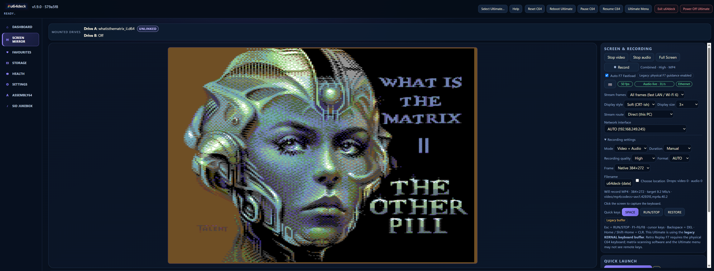
*Live VIC screen mirror with a working keyboard, stream controls and recording — the bezel follows the machine's real border colour.*

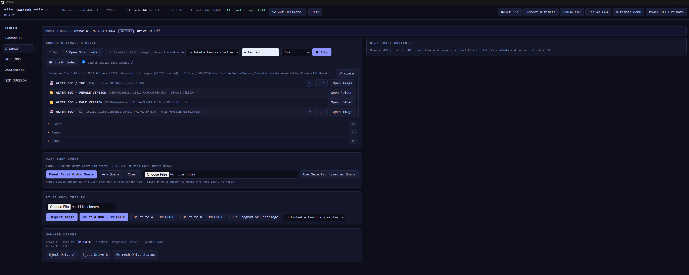
*Recursive storage search that looks inside disk images — finding a PRG buried in a Compunet demo disk, across 60,000 indexed folders, in seconds.*

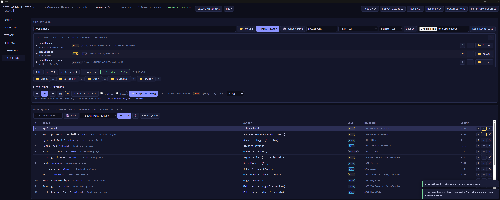
*SID Jukebox: instant search across the entire HVSC, one-click playback through the machine's own audio — plus "More like this" and Radio mode powered by SIDFlow similarity data (Chris Gleissner), with persistent play queues.*

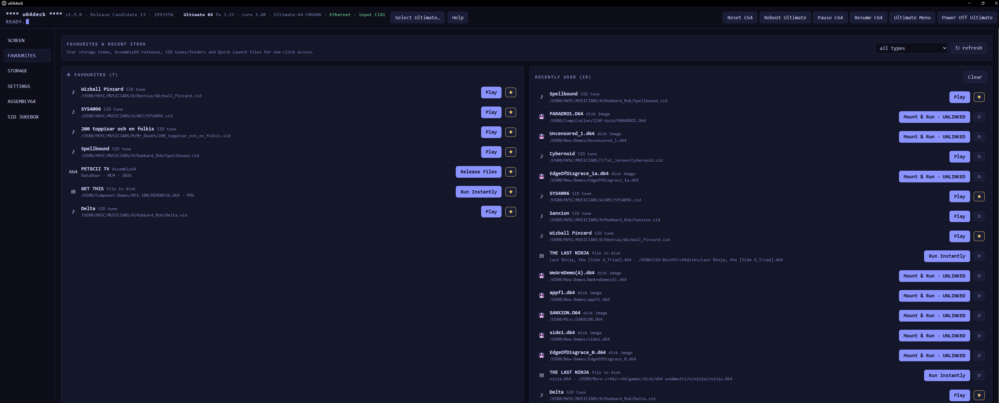
*Favourites and recent items — star anything (folders, disks, files inside images, SID tunes, Assembly64 releases) for one-click access.*

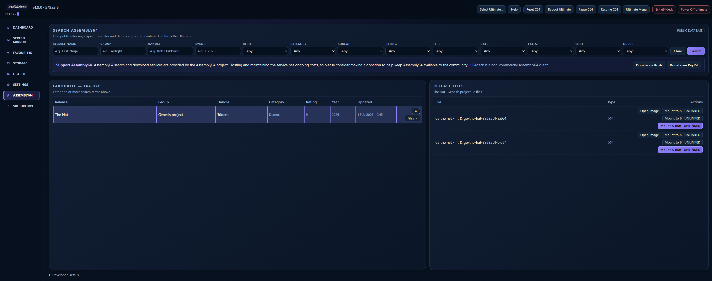
*Assembly64 search: fresh scene releases, filterable by category, rating and recency — deploy straight onto the machine with Mount & Run.*

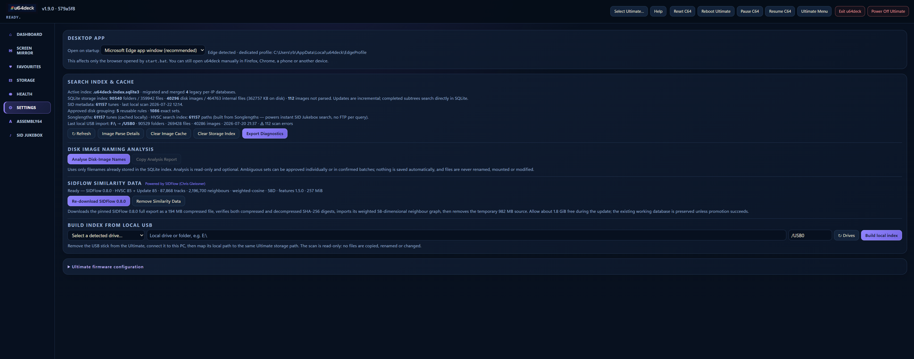
*Full firmware settings access — every category editable from the browser — plus index management and the SIDFlow similarity data panel.*

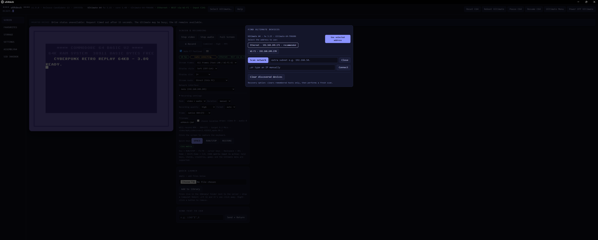
*Find Ultimate Devices — one row per device with verified Ethernet (recommended) and Wi-Fi addresses, deduplicated by unique id.*

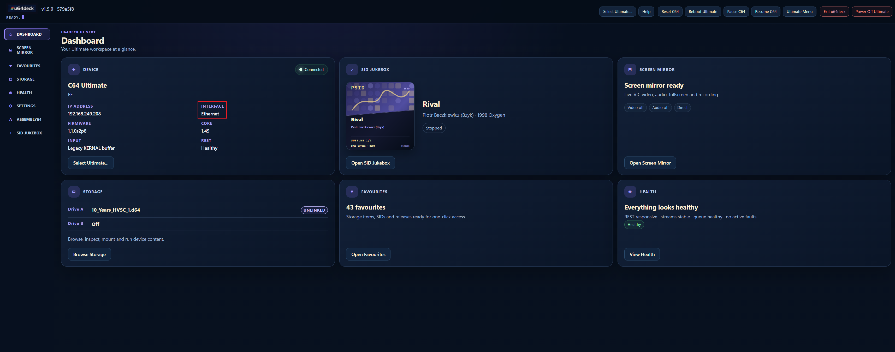
*Connected header showing the active link type, with one-click Switch to Ethernet when a wired address is known.*

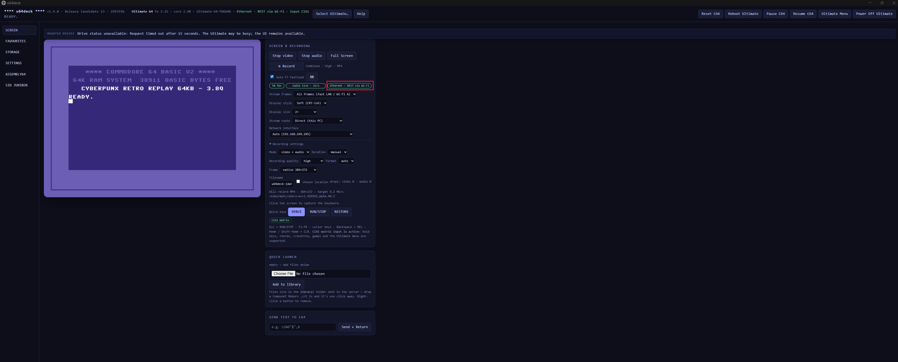
*When both interfaces belong to the same Ultimate, media and commands use Ethernet while status polling uses the faster Wi-Fi REST path — shown here as "Ethernet · REST via Wi-Fi" in the header.*

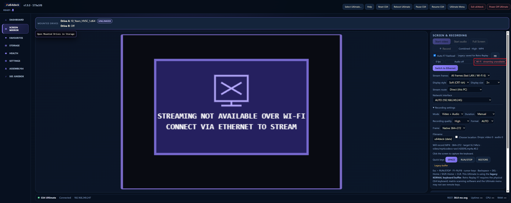
*Screen tab over Wi-Fi: streaming is wired-only, so video, audio and recording are clearly gated while the rest of the app stays available.*

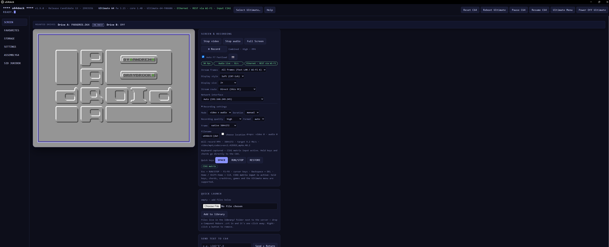
*Mount & Run types LOAD and RUN automatically once the machine is ready, with each readiness gate recorded in Diagnostics.*

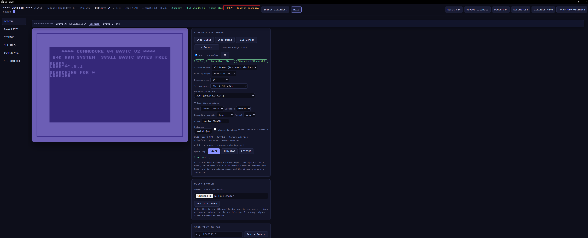
*Amber “BUSY — loading program…” state during a slow genuine-drive load, keeping the device connected instead of showing a false timeout.*

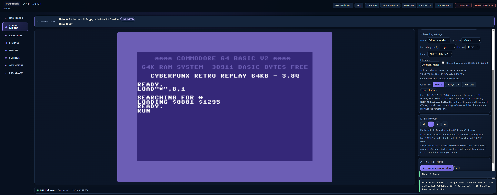
*Automatic multi-disk grouping with the swap bar, plus Add to Swap Queue for sets that are intentionally left ungrouped.*

## Quick start

### Tier 1 — Windows, no Python

Download `u64deck.exe` from <https://github.com/zildac/u64deck/releases/latest>, put it in a folder of its own, double-click it, open http://localhost:8064 and hit **Select Ultimate…** in the header — it sweeps your local subnet(s) and lists every Ultimate it finds; click **Use** to connect. No IP required.

The executable is fully self-contained and needs no Python installation. It creates and uses `config.json` and the SQLite index beside itself, exactly like the source version. Use **Exit u64deck** in the top bar to close the dedicated Edge app, stop the server and remove the executable's console cleanly; the connected Ultimate continues running. Windows SmartScreen may warn on first run of an unsigned exe; the release page publishes the file's SHA-256 for verification.

### Tier 2 — Windows from source

**Windows:** double-click `start.bat` (installs dependencies on first run,
then starts the server), open http://localhost:8064 and hit **Select Ultimate…**
in the header — it sweeps your local subnet(s) and lists every Ultimate it
finds; click **Use** to connect. No IP required. Use **Exit u64deck** in
the top bar to stop the Python server cleanly; closing only the browser window
does not stop the server. The connected Ultimate continues running.

### Tier 3 — Anywhere else (or by hand)

Anywhere else (or by hand):

```bash
pip install -r requirements.txt
python server.py --u64 192.168.1.64        # IP optional if you use Select Ultimate…
# open http://localhost:8064
```

Settings (device, interface, transport and passwords) live in
`config.json`, which u64deck **creates and updates by itself** and release
archives deliberately do not include. `config.example.json` documents the
available keys (`u64_host`, the Ultimate network `password`, FTP credentials,
`local_ip`, `stream_transport`, multicast groups and
`assembly64.client_id`).

### Updating an existing installation

Install every release into a **new, empty folder**. Stop the previous u64deck
process completely before copying user data, and do not extract a new release
over older Python, static or executable files. Overlay installs can leave a
mixed-version folder or stale bytecode and produce behaviour that is not
present in a clean build.

After the old process has stopped, copy only the persistent files you need:

- `config.json` — device and application settings;
- `user_items.json` — favourites and recent items;
- `playlists.json` — saved SID playlists;
- `.u64deck-index.sqlite3` — the stable storage/search index;
- `.sidflow-similarity.sqlite` — imported SIDFlow similarity data, when used.

Older installations may instead contain `.u64deck-index-*.sqlite3` files.
These can be copied into the fresh folder and u64deck will perform its existing
validated migration to the stable database. Copy SQLite databases only after
u64deck has shut down so pending writes are committed. Do not copy `*-wal`,
`*-shm`, `__pycache__`, `.pytest_cache`, `*.pyc`, temporary build/download
files, old source/static files or the previous executable.

Always run u64deck as a normal user, and always the same way — mixing elevated
('Run as administrator') and normal launches leaves files with mismatched
ownership and causes access-denied errors. If that has happened, use a fresh
folder and copy only the supported persistent files listed above.

## Interface-aware Ultimate discovery

An Ultimate 64 or C64 Ultimate can expose the REST API on wired Ethernet and
its ESP32 Wi-Fi interface at the same time. These are two interfaces belonging
to one physical Ultimate, not two independent devices. u64deck verifies each
live endpoint, groups matching responses using the firmware `unique_id`,
classifies the observed MAC address and recommends verified Ethernet.

This network identity drives visible application behaviour:

- one Finder row represents one physical Ultimate;
- both currently verified Ethernet and Wi-Fi addresses are shown in that row;
- Ethernet is marked as recommended;
- **Switch to Ethernet** appears when a verified wired address is known;
- wired-only video, audio and recording controls are explained and gated over
  Wi-Fi with **STREAMING NOT AVAILABLE OVER WI-FI**, while Storage, SID,
  Settings, Assembly64 and supported machine controls remain available.

### Prioritised single-pass discovery

`config.json` retains previously verified addresses as discovery history. On a
new scan, addresses that still belong to the PC's current local `/24` are placed
at the front of the same 64-worker pass as the rest of the subnet. This keeps
history useful without creating a separate blocking phase: a stale configured
or remembered address cannot postpone the fresh `/24` scan.

History is never treated as proof that an interface is online. Every address
must answer the current scan before it can be displayed, selected or
recommended, and every candidate receives exactly one direct `GET /v1/info`
request through the shared production transport module.

The transport deliberately separates connection time from response time:

- TCP has **1.5 seconds to connect**;
- after TCP connects, the Ultimate has **3.25 seconds to return the HTTP
  response**.

This is not a general five-second scan timeout. Hardware testing on Ultimate 64
firmware 3.15 showed Ethernet establishing TCP in roughly 5–54 ms while
occasionally taking about 2.1–2.6 seconds to return the first `/v1/info` byte.
The old single 1.5-second timeout therefore discarded a healthy wired endpoint.
The split design keeps unreachable subnet addresses bounded by the shorter
connect deadline while allowing an already-connected Ultimate REST service time
to answer.

The application deliberately uses no preliminary TCP port probe, async HTTP
substitute or same-scan retry pass. Each address is requested once. This avoids
losing a valid interface to an overly short port check and avoids the contention
caused by layered probes and retry storms. DHCP replacements are found by the
full subnet phase and supersede old addresses when the same interface MAC is
observed at the new IP.

### Responsive connection hand-off

Finder results are live verification results, not merely address suggestions.
When **Use selected address** is pressed, u64deck reuses the successful Finder
`/v1/info` result and the current MAC-based link classification rather than
immediately repeating those REST operations. Manual IP addresses still receive
a fresh verification request before the active backend is changed.

Connect does not block on the optional CIA1 keyboard capability check. A cached
capability is carried between the Ethernet and Wi-Fi addresses of the same
physical Ultimate; otherwise the check runs later without holding up Connect.
Routine status and Mounted Drives refreshes are coalesced and stand down while
a user-initiated device operation is active. Browser timeouts therefore do not
create a queue of stale polling work behind Connect or stream controls.

The address chooser is explicit: select the Ethernet or Wi-Fi button, confirm
the visible highlight, then press **Use selected address**. Ethernet remains the
default recommendation when it was verified during the current scan.

### REST service etiquette

Ultimate hardware exposes a capable but constrained embedded REST service.
Network clients should use bounded concurrency, bounded timeouts and coordinated
polling. More retries and longer request queues can reduce reliability by
creating contention rather than improving detection.

While **Find Ultimate Devices** is scanning, u64deck pauses routine status and
Mounted Drives polling. Discovery uses independent one-shot socket requests and sends at most one
`/v1/info` request to each subnet address during that scan. Interface classification then uses current MAC/ARP evidence only; it does
not issue follow-up `/v1/version` latency probes. Normal polling resumes when
the bounded scan finishes or fails. A second Finder scan cannot overlap the
first.

For troubleshooting, `discovery_diagnostic.py` imports this exact production
transport rather than maintaining a second scanner. For example:

```bat
python discovery_diagnostic.py --subnet 192.168.249.0/24 --cached 192.168.249.163 --cached 192.168.249.160
```

The diagnostic reads no u64deck configuration and sends no reset, mount,
keyboard or playback commands.

The **Clear discovered devices** action clears remembered identities and
addresses, disconnects the current session and performs a genuinely fresh scan.
It does not alter passwords, ports, SID/HVSC paths, mount preferences,
Assembly64 settings or other unrelated configuration.

When the link cannot be classified, u64deck labels it **Unknown** rather than
guessing. Streaming controls remain available for an Unknown link, and a
non-modal hint may suggest Ethernet if a stream starts but no video frame
arrives.

## Mount safety modes

The **STORAGE** tab defaults existing disk images to **Unlinked**:

- **Unlinked — temporary writes** permits drive writes while leaving the
  original image unchanged. Removing or replacing the image discards them.
- **Read-only (RO)** blocks drive writes.
- **Read/write (RW)** commits C64 drive writes to the original image.

The effective mode appears on each mount action, for example
**Mount & Run · UNLINKED**. The selector can override it at any time.

A blank D64/D71/D81/DNP created through **Create Blank Image** is mounted
immediately on drive A as **Read/write**, because a newly created disk is
normally intended to be populated. This is an action-level decision, not a
permanent hidden tag: opening that image later treats it as an existing image
and uses the selected default mode.

**Duplicate Image** creates a timestamped sibling copy on Ultimate storage.
**Back Up & Mount RW** verifies that a timestamped copy has been written before
mounting the original read/write.

## Stable index and automatic migration

u64deck stores storage, parsed-image and SID metadata in one stable
`.u64deck-index.sqlite3` beside the application. The filename is deliberately
not derived from the Ultimate's IP address, so DHCP changes no longer create a
fresh partial index.

On the first launch after upgrading from an older build, u64deck:

1. Detects all legacy `.u64deck-index-<address>-<id>.sqlite3` files.
2. Creates transactionally consistent copies under a dated `index-backups/`
   folder. The original databases are never modified.
3. Merges directory listings, disk-image catalogues and SID metadata, preferring
   the newest scan for each path. Historic orphaned child-cache rows that no
   longer have a valid parent record are skipped; they cannot be used safely,
   while the valid catalogue data continues to migrate.
4. Validates foreign-key integrity and confirms that the merged database
   preserves the storage, image and SID coverage of the source databases.
5. Atomically switches to `.u64deck-index.sqlite3` only after validation.

If migration fails, u64deck keeps using the currently selected legacy database
and reports the error in **Settings → Search Index & Cache**. Do not delete old
index files until the merged counts have been checked.

## SIDFlow recommendations and Radio

The SID Jukebox integrates the portable similarity export published by
[**SIDFlow**](https://github.com/chrisgleissner/sidflow), created by
**Christian (Chris) Gleissner**. u64deck v1.9.0 is pinned to the immutable
[`sidflow-data` 0.8.0 full export](https://github.com/chrisgleissner/sidflow-data/releases/tag/0.8.0)
for HVSC 85. Open **Settings → Search Index & Cache → SIDFlow Similarity Data**
to install or update it. Christian's
[u64deck migration guide](https://github.com/chrisgleissner/sidflow/blob/main/doc/migration/0.5-to-0.8-u64deck.md)
documents the upstream schema and model changes.

u64deck downloads `sidcorr-hvsc-full-sidcorr-1.sqlite.gz` (194,351,886 bytes,
about 194 MB), verifies its pinned SHA-256 digest, streams it to disk,
decompresses it to the byte-identical 982,155,264-byte SQLite export and
verifies the uncompressed digest as well. It then imports 87,868 tracks and
2,196,700 precomputed neighbour rows into `.sidflow-similarity.sqlite`. The
hardware-tested import produced a 269,389,824-byte local database (about 257
MiB / 269 MB). Allow roughly 1.8 GiB free while the compressed source,
decompressed source and compact build coexist; temporary files are removed
when the update completes.

On the hardware-tested Windows system, the real download, verification,
decompression and import completed in about 48 seconds. Allow roughly one
minute on a fast connection and SSD, but expect longer on slower broadband or
storage. Progress is reported separately for metadata, download, checksum
verification, decompression, compact import, neighbour import and promotion.

The existing working database remains in place until the replacement has
passed manifest, checksum, schema, model, row-count and SQLite validation and
has been promoted successfully. A failed or interrupted download/import leaves
the previous database untouched and removes temporary files where possible.

The primary recommendation engine is SIDFlow's weighted-cosine ranking over its
58-dimensional model. **♪ More like this** prefers results from different SID
files and uses sibling subtunes only when needed to fill the result set.
**Radio** excludes the current file, recently played files and files already in
the queue so one multi-subtune composition cannot dominate a station. SIDFlow's
published graph is fixed at 25 neighbours per seed; when local-HVSC filtering or
a long session exhausts it, u64deck can fill the remainder with its older local
48-dimensional feature scan. To determine which recommendations are actually
present on the Ultimate, u64deck unions the ordinary indexed `.sid` file list
with the optional SID metadata catalogue. A partial metadata scan — including a
single metadata row written after playing one SID — therefore cannot hide the
rest of an otherwise complete storage index. Zero-result Diagnostics report the
metadata, file-index, mapped, excluded and final candidate counts. That fallback
is explicitly labelled
`u64deck-fallback` in the queue tooltip and Diagnostics and is never presented
as SIDFlow's weighted result.

Settings and Health show the installed SIDFlow release, HVSC release, feature
schema, similarity metric, vector dimensions, track count and neighbour count.
Diagnostics records `sidflow-neighbors` and `u64deck-fallback` counts for each
recommendation batch.

An older installed dataset is retained on disk and displayed as **Update required**, but **More like this** and **Radio** will not use it. Selecting either
feature offers the pinned 0.8.0 update and opens Settings. With no network
available, the update reports the download error, the old database remains
untouched but gated, and ordinary SID browsing, queueing and playback continue;
recommendations remain unavailable until 0.8.0 is installed. With no dataset at
all, the same features offer installation and otherwise remain unavailable.

Selecting an individual SID from Search or the folder browser creates a one-tune
queue and plays it immediately. Use **＋** to append only that tune, or explicitly
choose **♫ Play This Folder** to load every SID in the current folder. **Clear
Queue** turns Radio off and removes queued tunes while allowing a SID already
playing to finish naturally; saved play queues, favourites and the similarity
database remain untouched. Local uploads, non-HVSC tunes and collection-version
path drift fail gracefully with a one-line explanation.

All recommendation work is local. u64deck does not upload listening activity,
ratings, favourites or queue contents to SIDFlow.

Attribution: recommendation data and similarity analysis are provided by
[**SIDFlow (Christian Gleissner)**](https://github.com/chrisgleissner/sidflow)
and the public
[`sidflow-data` 0.8.0 release](https://github.com/chrisgleissner/sidflow-data/releases/tag/0.8.0).

## Help and diagnostics

Use the text **Help** button in the top bar for searchable documentation, usage
examples and troubleshooting across Screen & Recording, Storage, indexing, favourites,
Assembly64, SID Jukebox and settings. **Export Diagnostics** under
Settings → Diagnostics & Support saves a ZIP containing version/build, sanitised
configuration, device and runtime information, stream counters, index/cache
statistics and recent errors. Supported browsers use an explicit write-and-close
file flow; other browsers use the normal Downloads fallback. Passwords, secret/token/key fields and media
content are excluded.

## Requirements

- Ultimate 64 with **firmware 3.11+** (REST API; 3.12+ for network password;
  3.15+ for CIA1 keyboard input),
  **or a Commodore 64 Ultimate** — including prkl_ultimate / Spiffy builds
  (1.1.x firmware line), which expose the same `/v1` REST API, port-64
  command socket, FTP and UDP streams. Screen/audio mirror needs a machine
  with the VIC streamer (U64 / C64U — the 1541 Ultimate-II+ has none).
- Python 3.10+ on any machine on the same LAN (or the standalone exe).

### Tested keyboard-input compatibility

| Hardware / firmware | Interactive keyboard input |
|---|---|
| Ultimate 64 firmware 3.15 | CIA1 matrix input |
| Ultimate 64 firmware earlier than 3.15 | Legacy KERNAL buffer |
| Commodore 64 Ultimate — current official, Spiffy and prkl firmwares | Legacy KERNAL buffer |

u64deck probes the available firmware capability and selects the supported input
method automatically. Bulk text and Mount & Run LOAD/RUN delivery retain the
compatible KERNAL-buffer path where required.

## Setup

### Standalone .exe (no Python needed)

The repo includes a PyInstaller spec and a GitHub Actions workflow
(`.github/workflows/build-exe.yml`) that compiles a single-file
**`u64deck.exe`** on a Windows runner:

1. Push this folder to a GitHub repo.
2. The **build-exe** action runs on every push — grab `u64deck.exe` from the
   workflow's artifacts (Actions tab → latest run → *u64deck-windows*).
3. Tag a release (`git tag v1.9.0-rc.44 && git push --tags`) and the exe is attached
   to the GitHub Release automatically.

Double-click the exe: it starts the server, opens the dedicated Edge app, and
you hit **Select Ultimate…**. A `config.json` placed next to the exe is picked
up for passwords/ports. **Exit u64deck** closes that app, completes the normal
server cleanup and retires the EXE console. The workflow verifies the embedded
icon and exercises this full launch/exit path before publishing. To build
locally instead:
`pip install pyinstaller && pyinstaller u64deck.spec` → `dist/u64deck.exe`.

Note: unsigned PyInstaller exes sometimes trip SmartScreen/AV heuristics —
you know the drill; it's your own build from your own repo.

### Publishing / releases

The repo is release-ready: `.gitignore` keeps `config.json` (passwords) and
`library/` (third-party binaries — see below) out of version control, and
pushing a `v*` tag makes the GitHub Action attach a freshly built
`u64deck.exe` to the release.

**Do not commit cartridge or disk images to a public repo** — files like a
Compunet Reborn CRT are someone else's software; the `.gitignore` excludes
`library/` for exactly this reason. Users drop their own copies in.

### Discovery

There's no broadcast/mDNS announce in the Ultimate firmware. Finder therefore
places live remembered addresses at the front of the same 64-worker direct
`GET /v1/info` pass as the remaining local `/24`. Persisted history no longer
forms a separate blocking stage. Each address has a 1.5-second TCP-connect
budget; only addresses that connect receive a separate 3.25-second HTTP-response budget.
It does not use a TCP port pre-scan and does not retry failed addresses during
the same scan. Routine status and drive polling pause until the scan has
finished.

Only addresses verified during the current scan are shown. Responses are grouped
by firmware `unique_id`, verified Ethernet remains preferred over Wi-Fi, and
DHCP changes are discovered by the full subnet phase. A fresh `/24` scan normally
completes in several seconds and requires **Web Remote Control** on the device.
If your Ultimate lives on a different subnet, enter that subnet prefix (for
example `192.168.50.`) in the extra-subnet box before scanning.

### Stream quality

In the SCREEN tab, **Stream Frames** picks between *Low latency* (drops stale
frames if the browser falls behind — best over weak links) and *All frames*
(buffers up to 64 frames so you keep the full 50 fps through brief hiccups —
the right choice on wired or Wi-Fi 6 networks). **Display Style** toggles sharp
nearest-neighbour vs soft CRT-ish scaling, and **Display Size** sets 2×/3×/fit.
All three persist across sessions. The stream itself is a fixed format from
the hardware (384×272, 4bpp, 50 fps, ~2.7 MB/s) — quality settings change
how it's relayed and drawn, not the source.

**Transport** picks how the stream travels:

- *Direct (unicast)* — the device streams straight to this PC. Default.
- *Multicast (shared)* — the device streams to a multicast group and u64deck
  **joins** it (defaults `239.0.1.64`/`.65` — the same groups
  prkl_ultimate's Data Streams page uses). Any number of receivers can watch
  simultaneously: u64deck's mirror and VLC (via the vlc-u64stream plugin)
  see the same stream, and neither steals it from the other. If a multicast
  stream is already running (started from prkl's web page), just switching
  Transport to Multicast makes it appear — no need to press Start, which
  would merely re-point the device at the same group anyway.

**Interface** matters on multi-homed machines: if you run virtual adapters
(Hyper-V, WSL, VPNs), the automatic "which of my IPs should the device
stream to" pick can land on the wrong one — the classic symptom is a stream
that never arrives. Choose your real LAN adapter from the Interface dropdown
(the list comes from your actual NICs) instead of disabling adapters; the
choice applies to unicast destinations and to which NIC multicast groups are
joined on, and re-points any running stream immediately. `local_ip` in
`config.json` makes it permanent.

Groups/ports are configurable (`multicast_video`, `multicast_audio`,
`stream_transport` in `config.json`). Heads-up: in *Direct* mode, pressing
Start redirects the device's single stream output to this PC — so if VLC was
watching a multicast stream, it goes dark until you restart it. Multicast
mode is the right setting if you use both.

### Firewall

The video/audio mirror needs inbound **UDP 11000 (video) and 11001 (audio)**
from the Ultimate to the machine running u64deck. On Windows:

```powershell
New-NetFirewallRule -DisplayName "u64deck streams" -Direction Inbound `
  -Protocol UDP -LocalPort 11000,11001 -Action Allow
```

## How the pieces talk

| Function | Transport |
| --- | --- |
| Settings, mounting, run PRG/CRT/SID, machine control, stream start/stop | REST API (`/v1/...`) |
| Keyboard injection, stream start/stop fallback for older firmware | TCP command socket, port 64 (`0xFF03 KEYB`) |
| Video (384x272 @ 4bpp, 50 fps) / audio (S16LE stereo, 47983 Hz) | UDP 11000 / 11001 → WebSocket → canvas / WebAudio |
| Browsing Ultimate storage, fetching images for inspection | FTP (port 21) |

D64/D71/D81 parsing (directory + sector-chain extraction) happens server-side
in `d64.py`, so "run this one PRG off that disk" is: FTP-fetch (or upload) →
parse → extract → `POST /v1/runners:run_prg`. The disk drive never spins.

### Cartridges vs DMA run (Retro Replay etc.)

Running a PRG/SID/MOD uses the firmware's DMA loader, which swaps in an
internal boot cartridge and then restores yours. With a freezer cart
(Retro Replay / Action Replay) the restore handshake can fail, and the
firmware's fallback is a **hard reset into the cart menu** — the classic
"demo starts, machine reboots to the RR screen". u64deck defends against
this by default (`cart_safe_run: true`): before a DMA run it blanks the
Cartridge config item, runs, then writes the original value back. Config
changes only apply at the next reset, so the launched program keeps
running with the cart parked — and flash is never written, so even a
worst-case crash is undone by a power cycle. CRT launches are exempt because they replace the active cartridge by definition.
u64deck records that temporary runner state. Before a later Mount & Run it
performs one full Ultimate reboot, restores the firmware-configured cartridge,
then reads that setting live before choosing any cartridge-startup action.
Trade-off: while a program started through the cartridge-safe path runs, the
freezer is inactive until the next reset.

### Cartridge boot menus (Retro Replay etc.)

Mount & Run and Mount & Load type through the supported input path after a reset. With a
cartridge like **Retro Replay** active, reset lands in the cart's boot menu
first — and if the typed `LOAD` characters arrive while that menu is up, the
menu interprets them (that's how you end up staring at the MC monitor).

Mount & Run waits for the machine before typing. After the normal reset
settle, u64deck polls the KERNAL readiness flag at zero-page `$CC` and requires
two consecutive ready readings before sending the `LOAD` line. On CIA1-capable
Ultimate 64 firmware, the complete `LOAD"*",8,1` command is delivered as one
ordered matrix-input event batch, followed by matrix `RUN` after the post-load
readiness gate. This avoids the port-64 eight-byte boundary that could
intermittently discard the first `LOAD"*",` part during immediate repeated
launches. Legacy-only C64 Ultimate firmware retains the established
KERNAL-buffer LOAD and RUN delivery. Each readiness gate can wait for up to 2
minutes and records its result and delivery method in Diagnostics. If the
machine remains busy, nothing further is typed and the UI reports whether
`LOAD` or `RUN` was withheld.

Hardware testing isolated Retro Replay's intermittent Freeze Menu entry to F7
injected through the **Legacy KERNAL keyboard buffer**. A physical C64 F7 key is
reliable, and the CIA1 matrix-input path is unaffected. Legacy cartridge control
remains best-effort on the tested C64 Ultimate + Retro Replay combination: allow
approximately 3–5 seconds between Reset/Reboot actions and before starting Mount
& Run. Other freezer/fastload cartridges have not been comprehensively tested.

Before every Mount & Run, u64deck reads the current firmware
**C64 and Cartridge Settings → Cartridge** value. That live preflight is the
authoritative decision; a same-device cache is maintained for the UI and
Diagnostics and is used only as a short, bounded fallback when an immediate
firmware read fails. If neither can confirm the state, Mount & Run stops before
resetting rather than guessing.

The resulting behaviour is deliberately narrow:

- **No configured cartridge:** normal BASIC readiness, LOAD and RUN; no F7 and
  no cartridge prompt.
- **Retro Replay + CIA1:** the saved Auto F7 preference uses the existing matrix
  F7 path.
- **Retro Replay + Legacy:** no buffer-injected F7 is sent. When Auto F7 is saved
  as enabled, a persistent **Physical F7 required** card explains the Legacy
  limitation, asks for physical C64 F7, and u64deck continues when BASIC is ready.
- **Retro Replay with Auto F7 disabled:** the prompt wording follows the detected
  input mode. CIA1 offers the physical keyboard or Screen controls; Legacy asks
  for the physical C64 keyboard without claiming the cartridge is unsupported.
- **Another configured cartridge:** no guessed F-key is sent. A mode-specific
  **Cartridge startup requires attention** card says that automatic startup
  handling is unrecognised and asks the user to reach BASIC manually.

The Mount & Run cards include **Cancel Mount & Run**; firmware without `machine:readmem`
also provides **Continue** after the user has reached BASIC READY. Remote Screen-Mirror F7 remains suppressed on Legacy input.
After a standalone Reset or Reboot, Legacy + Retro Replay shows a separate informational
**Physical F7 required** overlay with **Dismiss**. It does not attempt to detect the physical
keypress or hold the coordinator. Instead, the browser performs one short BASIC-readiness
check at a time and requires two consecutive ready readings; each probe releases the device
coordinator immediately. When Fastload/BASIC is detected, the card briefly reports
**Fastload detected — ready** and then clears automatically. Firmware without
`machine:readmem` keeps the Dismiss-only behaviour. Automatic fastload-menu handling is currently supported and hardware-tested only for **Retro Replay**.

During a slow genuine-drive load the Ultimate's embedded HTTP service can be
unavailable even though the machine and mounted drive are operating normally.
While Mount & Run owns that operation, u64deck reports **BUSY — loading
program…** in amber instead of treating the expected status timeout as an
offline device. Status is retried locally and refreshed immediately when the
Mount & Run request completes; genuine connection failures outside that window
continue to use the normal offline handling.

The SCREEN tab has an **Auto F7 Fastload** checkbox.
The saved preference is retained across device changes, but it becomes effective only when the current
firmware Cartridge setting is confirmed as Retro Replay. On CIA1-capable devices
u64deck then uses matrix F7 after its own Reset/Reboot and during Mount & Run or
Mount & Load startup. On Legacy devices the control is visibly disabled as an
effective capability and its tooltip explains that physical C64 F7 is required
because an emulated F7 can open the Freeze Menu. Standalone Reset/Reboot displays
an informational overlay; Mount & Run displays the active waiting overlay. With no
configured cartridge, Auto F7 is skipped and Mount & Run proceeds normally.
Switching back to a CIA1-capable device restores the saved preference. The
option is disabled by default and cannot react to physical-device or
software-triggered resets.

The corresponding advanced `config.json` settings are:

- `boot_wait` — seconds between reset and typing (default 2.8; raise to
  ~4.5 if your cartridge or firmware takes longer).
- `boot_prekey` — the cartridge-menu key. The UI checkbox sets this to `"F7"`
  or clears it. Other supported manual values are F1–F8, RETURN and SPACE.

## Favourites and recent items

SID tune cards provide both **Play** and **＋**. Play starts a one-tune queue; ＋ appends the SID without interrupting current playback.


The **FAVOURITES** tab is a lightweight launcher for commonly used content.
Use the ☆ control in Ultimate storage, Assembly64, the SID browser/search/
play queue or Quick Launch to save an item. Opening, mounting, running or playing
content also updates the recent-items list automatically. The state lives in
`user_items.json` next to `config.json`; release archives do not include it, so
updates preserve it.

## Video and audio recording

The SCREEN tab's **Record** button starts the mirror's video and audio streams
when required, captures the 384×272 canvas at 50 fps and combines it with the
48 kHz stereo audio stream using the browser's `MediaRecorder`. Stopping creates
a timestamped `.webm` download. Recording is performed locally in the browser;
no capture data is sent elsewhere and no FFmpeg installation is required.
Chrome/Edge provide the most consistent WebM support. A dedicated red dot
shows recording activity; the button, elapsed time and global opaque tooltip
remain stable while status updates occur. MP4 is selected automatically where
the browser supports it, with WebM fallback and repaired duration metadata for
seeking.

Before streaming starts, after **Stop video**, or after an unexpected browser
video-socket disconnect, the canvas displays a deliberate VIDEO NOT CONNECTED
panel instead of leaving the final C64 frame frozen. The panel also reports when
audio remains connected. The audio badge separately shows its connection state
and, while live, the received chunk rate (normally about 31/s).

## SID Jukebox

The Currently Playing line uses a larger title, badge and duration treatment for readability.

The SID JUKEBOX tab plays SID collections through the machine's real SID chip:
point it at an Ultimate storage folder (or the **Open SID Jukebox** button in the
STORAGE browser plays the folder you're looking at), or load local .sid
files. The play queue shows title/author/released parsed from the PSID/RSID
headers; click any tune to play, ⏮ ⏭ ⏹ and shuffle do what they say, and
multi-tune SIDs get a subsong selector. The **Length** column is populated as
soon as tunes enter the queue by matching their HVSC path and selected subsong
against Songlengths.md5; an unknown duration is shown as —. The queue expands to fill the remaining
Jukebox height and keeps its headings visible while only the rows scroll. When
all indexed entries share one author, that author appears once in the queue
heading instead of being repeated in every row; mixed-author queues retain the
Author column, while narrower windows fold author/release details beneath the
title. Folder and saved-play-queue entries are loaded lazily, browser requests
have timeouts and status polling cannot overlap, so a busy native SID player
does not make the whole interface unresponsive.

Saved play queues can be loaded before any tune is selected. The selector and
**Load** button remain visible on a fresh start or direct Jukebox visit, after
**Clear Queue**, and before choosing content through Search, folder browsing or
the local-SID picker. The same empty-queue state is used while entry from
Storage, Favourites or Recent Items is waiting to populate. **Save** and **Clear
Queue** remain disabled until an active queue exists, while **Delete** is enabled
only after a saved queue is selected.

**Auto-advance and native duration display**: tunes advance automatically. With
HVSC's `Songlengths.md5` configured (`songlengths_path` in `config.json`),
u64deck generates a tiny per-SID `.ssl` duration array and attaches that when it
uploads a SID, allowing the Ultimate's own SID-player screen to show the
documented length for the selected subtune. The complete Songlengths database
is never uploaded to the device. Queue lengths are resolved from the path
catalogue before lazy tunes are fetched, then confirmed by digest once a tune is
played. For matched Songlengths entries, u64deck waits a configurable short
end grace before launching the next tune when streamed fade is disabled. The
optional **Fade streamed SID ending** control keeps the selected native subtune
alive for the chosen fade duration, starts a linear browser fade at the
documented endpoint, then holds browser gain at zero until the backend confirms
the replacement SID has started. Any buffered tail from the previous tune is
cleared before full gain is restored, preventing the old SID from briefly
returning between tracks. While fade is enabled, its duration replaces rather
than combines with `sid_jukebox_end_grace_secs`. The fade affects audio heard
through the u64deck browser and browser recordings only. Ultimate HDMI and
analogue output remain at full volume until the extended native endpoint.
browser fade defaults to 2.5 seconds and can be disabled in the Jukebox UI. Without Songlengths, `sid_default_secs` (default 180) applies (0 =
loop forever) with the established fallback timing and no fade. If your HVSC lives on the device, you don't even need to set it:
on first jukebox use u64deck **auto-detects the HVSC root** (a folder
with MUSICIANS + DOCUMENTS, e.g. `/Usb0/HVSC` or `/Usb0/C64Music`),
saves it as `hvsc_path`, wires `songlengths_path` to its
`DOCUMENTS/Songlengths.md5`, and fetches that over FTP (cached locally).
The jukebox browser and 🎲 Random dive then home to the collection
automatically.

**🔎 HVSC search**: the search box in the SID JUKEBOX tab searches the
*entire collection instantly* — no device traffic per query. Before a SID
metadata scan, HVSC's own Songlengths.md5 provides a filename/path index.
After a metadata scan, SQLite also searches header title, author, release and
path fields. Multi-word queries AND together ("hubbard sanxion"). ▶ Play on a
hit creates a one-tune play queue and starts it; use **＋** to append a tune or
**Play This Folder** when the complete folder is intended. Adding an individual
SID, inserting More like this recommendations or removing a future queue entry
does not invalidate the active tune's auto-advance timer: a queue is played in
order no matter how its future entries were added. The small ♪ action on a queue
row uses that row as the similarity seed, while the larger Now Playing action
uses the tune currently being heard; both insert their results after the current
tune. The queue keeps Title and Author visually associated, labels a More like
this queue with its seed tune, and marks the playing row with a persistent ▶,
stronger highlight and left accent that are distinct from hover. Playback start
or auto-advance reveals the current row once without fighting later manual
scrolling; **◎ Current** jumps back to it on demand.

**Chip, Format and Year filters**: the Chip selector filters 6581, 8580, Either,
Mixed/Multi-SID and Unknown declarations. Format filters PSID or RSID. Year is
an exact four-digit value from 1900 to 2099 matched against a standalone year in
the SID release metadata. A text term is optional, so any metadata filter can be
used alone or combined with the others. Chip badges use the same meanings in
search results, the Play Queue and Now Playing: amber 6581, cyan 8580, violet
Either, pink Mixed/Multi-SID and grey Unknown. The dropdown selection remains
the indication of the active filter. These filters use the SID metadata
catalogue described below.

**SID Index & Metadata**: use the clearly labelled **SID Index** button in the
SID JUKEBOX browser toolbar to open or close the indexing controls. Once a scan
is complete the button shows the indexed tune count; while a scan is running it
shows live parsed progress. The scan parses the small PSID/RSID header for every
tune and stores title, author, release, chip model, PSID/RSID format, header
version, subtune count, default subtune, clock and SID count in the same
per-device SQLite database. Play queues stay lazy — the complete tune is still
fetched only when it is played — but the Chip and other columns can now be
populated immediately.

There are two scan sources:

- **Refresh From Ultimate** reads only SID headers over FTP. It is incremental
  but a complete HVSC collection can still take a long time because of the
  number of individual files.
- **Build From Local HVSC** is the preferred initial scan. Connect the storage
  to the PC, select the local HVSC folder (the folder containing `MUSICIANS`
  and `DOCUMENTS`), and map it to the same Ultimate path, normally
  `/USB0/HVSC`. Selecting the drive root is also accepted when u64deck can find
  one unambiguous `HVSC` or `C64Music` child. The scan is read-only and reads
  only the first 124 bytes of each SID.

Both modes support pause, resume and stop. Unchanged files are reused using
size/mtime metadata. Leave **rescan unchanged files** off for normal refreshes;
it deliberately bypasses the cache and reparses every header. A completed local
index does not need to be rebuilt unless the collection changes or a full rescan
is intentionally requested. Completed scans reconcile removed tunes so stale
search results are not left behind.

**⭳ Updates?**: compares your collection's release (read from STIL.txt /
BUGlist.txt headers on the device) against the latest on hvsc.c64.org.
Applying updates stays a job for the official HVSC Update Tool on your
PC (update packs rename/move thousands of files by script — not
something to improvise over FTP against your only copy); once applied,
press **↻ Re-detect** to reload the collection path and Songlengths, then run
the local or Ultimate SID metadata refresh to reconcile header metadata.

**🎲 Random Dive**: chooses a random `.sid` from the case-insensitive SQLite
storage index beneath the current path. For HVSC paths it can fall back to the
Songlengths index after mapping the configured collection root. The selected
SID starts immediately as a one-tune Play Queue. The complete file is fetched
only when it is actually played, avoiding a burst of FTP work while the
Ultimate's native SID player is active. Errors distinguish an
unindexed folder, a folder with no SIDs and an unresolved HVSC mapping.

## Search

The 🔎 box in Browse Ultimate Storage searches **recursively from the current
folder down** — matching folder names, file names, and (with "in images"
ticked) the directory entries *inside* every D64/D71/D81 it finds. Results
are actionable: Mount & Run / Browse images, Run PRGs and T64s, jump to the
containing folder, or Run a hit straight out of its disk image. **🗂 Index volume** walks an entire subtree once (background job with
live status and Stop) — every folder listing and every disk image goes
into the persistent caches, so subsequent searches of that tree run
near-instantly, essentially offline. Re-indexing refreshes folder
listings but reuses unchanged images (mtime-keyed), so it's cheap.
Searches of un-indexed areas still walk live.

After a completed **Local USB index**, the same control is relabelled
**🔎 Verify from Ultimate**. Verification is optional: it walks the whole mapped
subtree over FTP, keeps the local index available for searches while it runs,
and reports unchanged/new/changed directory and image counts. Normal folder
browsing already refreshes the folder being viewed, so an unchanged stick does
not need a full verification pass when returned to the Ultimate.

The search streams results live with a running status
(folders walked, images opened, current path), governed only by the time
limit you pick next to the box (30s up to ∞ — the Stop button is always
available). Image directory listings are **cached persistently** across
searches and restarts, keyed by path + size + FTP modification time, so
a re-searched tree costs almost nothing on images — and a rewritten disk
is automatically re-read, not served stale.

## Blank disks

**Create Blank Image** in the STORAGE browser creates a formatted blank image in the
current folder using the firmware's own creator: D64 (35 or 40 tracks),
D71, D81, or DNP (CMD native, choose track count), with a custom 16-char
disk label. G64 isn't exposed by the device API — that one still needs the
U64's own menu.

Assembly64 disk actions use the complete release-file manifest for conservative
matching. When the selected image belongs to a confidently named family, such
as terminal `-a` / `-b`, u64deck downloads only those related images, applies
the existing 64-file / 96 MiB swap-set limits, arms the in-memory queue, and
then mounts the disk that was actually selected. This works on the first mount
after a clean start and does not rely on a previously mounted image. Single or
ambiguous releases remain one-disk sets.

## Multi-disk software (swap & queue)

Two ways to handle "INSERT DISK 2" software, both ending at the **DISK SWAP**
bar on the SCREEN tab, which swaps disks into the drive **without a reset** —
the running software just sees the disk change:

**Automatic** — just Mount & Run any disk from Ultimate storage. u64deck
conservatively groups only sibling images whose complete title and recognised
suffix match, such as `Game side1.d64` / `Game side2.d64`, `Game (Disk 1).d64`
/ `Game (Disk 2).d64`, `ThePhoenixCode-Disk1-BZ.D64` /
`ThePhoenixCode-Disk2-BZ.D64`, or `Scratch-1.d64` / `Scratch-2.d64`. A shared
release/language tag after the disk number is retained as part of the match.
The matcher also recognises compound numbered tokens such as
`EdgeOfDisgrace_0.d64` / `_1a.d64` / `_1b.d64`, bare parenthesised tokens such
as `WeAreDemo(A).d64` / `(B).d64` and `Game(1).d64` / `(2).d64`, plus
title-less marker names such as `side1.d64` / `side2.d64` within one folder,
and terminal hyphen-delimited pairs such as `the-hat-7a825b1-a.d64` /
`the-hat-7a825b1-b.d64`. Terminal `-a` / `-b` matching is case-insensitive.
Square-bracket letters such as `Game[a].d64` remain excluded as alternate-dump
markers. A bare-token family is also vetoed when an unsuffixed sibling exists,
such as `Game.d64` beside `Game(a).d64`. Glued digits such as `Turrican1.d64`
and `Turrican2.d64` are deliberately not grouped because they are
indistinguishable from sequels; use the manual queue or a separator in the
filename when they really are disk sides.
Merely sharing a folder or ending in a number is not enough. Matching disks are naturally
sorted, so `disk 10` follows `disk 9`. If there is more than one, the swap bar
appears: numbered buttons jump to any disk and ▶ mounts the next. Ambiguous
names remain a one-disk set; use the manual queue when needed. After each
mount, u64deck reports what the matcher decided and lists the related images.
The automatic set is reconstructed from the currently mounted device path after
an application restart or when **Refresh Drive Status** is used.

### Analyse disk-image naming

**Settings → Search Index & Cache → Analyse Disk-Image Names** examines D64,
D71, D81 and G64 filenames already held in the SQLite index. It does not rescan
the Ultimate. Results separate recognised families, high-confidence unrecognised
patterns, ambiguous names and protected/rejected conventions, with counts and
representative examples. **Copy Analysis Report** exports the analysis as plain text.

Analysis is optional and read-only. If it is never run, u64deck uses only its
normal built-in Disk Swap matcher, including the terminal `-a` / `-b` support.
Opening or rerunning the analyser does not save anything. A high-confidence
pattern can be approved globally or for one indexed folder only after preview
and confirmation. u64deck stores approved patterns as constrained fields
(terminal position, delimiter, marker letters, extensions and scope), never as
arbitrary regular expressions.

Ambiguous results can be approved individually, by selected displayed examples,
for **all current ambiguous sets**, or for every ambiguous set in one folder.
The all-ambiguous action explicitly includes sets not displayed among the
representative examples and adds a second confirmation for large collections.
These batch actions create exact-set overrides only; they never promote an
ambiguous filename into a reusable pattern. Every batch confirmation reports
the number of sets, files and folders affected. Approved exact sets are shown
50 at a time so collections with hundreds or thousands of approvals remain
usable; selected enable, disable and remove actions apply to the current page.

**Remove all local approvals** deletes every user-approved reusable rule and
exact-set override after two confirmations. It does not alter files, filenames,
index entries or built-in matching. Approved rules and exact sets otherwise
persist across index refreshes and rebuilds and become active immediately for
automatic Disk Swap grouping.

GoodTools-style `[a]` / `[b]`, matching unsuffixed siblings, glued sequel-like
numbers and mixed/conflicting marker families remain protected from reusable
automatic approval. An exact-set approval is the deliberate one-off escape hatch
for unusual media naming. Clearing the storage catalogue leaves these explicit
local approvals intact so that they can apply again after rebuilding the index.

A compact **Mounted Drives** strip appears at the top of SCREEN and STORAGE,
showing both drive images and their effective RO/RW/UNLINKED mode. Click it to
jump to the full eject and refresh controls. Mount & Run updates this strip as
soon as the Ultimate confirms the mount, before the subsequent reset and slow
real-drive load have finished. During the amber BUSY state u64deck keeps that
confirmed filename visible instead of replacing it with a drive-status timeout,
then reconciles the display with the device immediately after loading completes.

**Manual queue** — when you want to choose the exact disks and order: in the
STORAGE tab, choose **Add to Swap Queue** on each image in order (1, 2, 3…); the DISK SWAP QUEUE
panel lists your picks (✕ removes one). Then **Mount #1 & arm** boots the
set, or **Arm only** stages it for later. Your click order is the disk
order — deliberately never re-sorted, so Side-B-first oddities work. For
disks on your PC instead of the device, use the multi-file picker in the
same panel (**Arm local set**): the whole set uploads, disk 1 mounts, and
the swap bar drives the rest — device storage never touched.

Mid-demo the ritual is: software asks for disk N → click **N** (or ▶) in the
swap bar → click the screen → press the key it's waiting for. Done.

## Acknowledgements

u64deck was inspired in part by the workflows provided by **U64 Manager** and
**Assembly64**, particularly around discovering Ultimate hardware and launching
content over the network. u64deck extends that model with interface-aware
discovery: Ethernet and Wi-Fi endpoints are verified independently, grouped into
one physical device using the Ultimate `unique_id`, and used to recommend the
preferred link and explain or gate network-dependent UI features.

**SIDFlow-powered recommendations are made possible by Christian (Chris)
Gleissner**, who created [SIDFlow](https://github.com/chrisgleissner/sidflow),
published the portable
[`sidflow-data` export](https://github.com/chrisgleissner/sidflow-data/releases/tag/0.8.0)
and provided a dedicated
[u64deck migration guide](https://github.com/chrisgleissner/sidflow/blob/main/doc/migration/0.5-to-0.8-u64deck.md).
u64deck's **♪ More like this** and **Radio** features consume that release
locally; no ratings or listening data are uploaded back to SIDFlow.

## Security notes (honest ones too)

The Ultimate's own services — REST, FTP, the port-64 socket, even the
network password header — are **plaintext by firmware design**; nothing a
client can do changes that, so treat the device like the friendly LAN
appliance it is (put it on your IoT VLAN if you segment).

The **browser → u64deck** hop, however, is ours to secure:

- `http_host` in `config.json` — set `"127.0.0.1"` to make the UI reachable
  from this machine only. The default `"0.0.0.0"` serves the whole LAN
  (needed for phone/tablet use — but then anyone on the network can drive
  your C64).
- `tls_certfile` / `tls_keyfile` — point at a cert/key pair and the UI is
  served over https (e.g. `openssl req -x509 -newkey rsa:2048 -nodes
  -keyout key.pem -out cert.pem -days 365 -subj "/CN=u64deck"`).

`config.json` may contain the device passwords, which is why it's
`.gitignore`d and excluded from release zips.


## Known limitations (honest ones)

- **Interactive keyboard support depends on firmware and hardware.** u64deck
  probes `/v1/machine:input` for CIA1 matrix-level press/release input. When the
  endpoint is absent or unsupported, it falls back to the KERNAL keyboard
  buffer; bulk text and LOAD/RUN automation deliberately continue to use that
  efficient buffer path.
- **Run (DMA) is single-file.** Multi-load games/demos need their disk —
  that's what Mount & Load is for.
- **Mount & Load timing** is a fixed ~2.8 s wait for BASIC after reset. If you
  run a fastloader kernal or odd cartridge config, adjust the sleep in
  `image_mount_load` in `server.py`.
- **Assembly64 endpoints aren't officially documented**; the tab shows raw
  responses so the templates in `config.json` can be adapted if the service
  changes shape.
- **Legacy Retro Replay F7 requires the physical C64 keyboard.** Legacy Retro
  Replay control is best-effort on the tested C64 Ultimate combination. On the tested C64 Ultimate + Retro Replay combination,
  injected Legacy-buffer F7 can enter the Freeze Menu, so u64deck suppresses
  remote/automatic F7 and asks for physical F7 instead. Allow approximately
  **3–5 seconds** between Reset/Reboot actions and before starting Mount & Run.
  Mount & Run confirms the firmware Cartridge setting, shows the persistent
  Screen-Mirror prompt only for Retro Replay (including `rr38pal`), and proceeds
  without a prompt when no cartridge is configured. Standalone Reset/Reboot uses an informational Dismiss overlay
  that clears automatically after two short BASIC-ready samples when read-memory support is available; Mount & Run actively waits for BASIC readiness. Other freezer/fastload cartridges have not been comprehensively
  tested. This behaviour was not observed on the CIA1 matrix-input path, where
  automatic matrix F7 remains available.
- One image at a time is cached in RAM per browse (last 8 kept).
- **Dual-interface (Ethernet + Wi-Fi both enabled) is best-effort.** The
  firmware's ~2.5 s wired REST delay makes mixed-interface control
  intermittently flaky; split routing reduces but does not eliminate it.
  Single-interface — ideally Ethernet-only — is the reliable setup.

## Files

```
server.py          FastAPI backend + WebSocket stream bridge
ultimate.py        REST / TCP command socket / UDP receivers / FTP client
d64.py             D64/D71/D81 directory parser + file extractor
index_store.py     SQLite filesystem and disk-image catalogue
local_indexer.py   read-only local USB scanner and path mapper
sid_indexer.py     read-only local SID-header metadata scanner
sidflow_similarity.py  SIDFlow 0.8.0 validation, decompression, import and recommendation ranking
device_coordinator.py  priority scheduling for Ultimate operations
static/index.html  the whole UI
config.json        host + ports + Assembly64 endpoint templates
```

### Building the initial index from a local USB stick

For a large collection, local indexing avoids transferring every directory and
D64/D71/D81 through the Ultimate's FTP service:

1. Stop any current index and safely remove the stick from the Ultimate.
2. Connect it to the PC running u64deck.
3. Open **Settings → Build Index From Local USB**.
4. Select the detected drive (or enter its local folder) and map it to the same
   Ultimate path, normally `/USB0`.
5. Press **Build local index**. Pause, resume and stop use the same controls as
   network indexing.
6. Return the stick to the Ultimate when the scan completes.

The process is read-only and writes only to u64deck's per-device SQLite file.
It never copies, renames or modifies content on the USB stick. Matching images
already present in SQLite are reused, and a completed import removes stale
catalogue paths that no longer exist on the local volume. Returning an unchanged
stick to the Ultimate requires no further action: searches use the imported
index immediately, and opening a folder refreshes that folder. The optional
**Verify from Ultimate** action is only for a full FTP comparison after changes.

### Occasional incomplete status responses

The Ultimate's embedded HTTP server can occasionally close a status response
before sending its advertised body. u64deck retries safe GET requests once over
a fresh connection and preserves the last known device details while it performs
a quick follow-up check. Mutating operations are never automatically replayed.

### Indexing and device writes

Volume indexing runs in the background. Operations that modify Ultimate storage,
such as creating a blank disk image, temporarily pause the indexer and wait for
any active FTP transfer to finish. Storage containing legacy 8-bit filenames is
handled automatically if the Ultimate FTP service cannot decode a listing as
UTF-8. Indexing resumes automatically when the write
completes.
